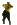

Hipchat Emoticons
=================

A repository of custom hipchat emoticons used at [Pantheon](http://getpantheon.com).

* Update: Emoticons used at [V-Nix.nl](http://www.v-nix.nl)

*Note: You can discover all the default, built-in hipchat emoticons at [hipchat-emoticons.nyh.name](http://hipchat-emoticons.nyh.name/)*

Creating custom emoticons
-------------------------

Custom hipchat emoticons can be uploaded through your Hipchat account by admins: https://hipchat.com/admin/emoticons

> Images must be under 100Kb and have max dimensions of 25px-tall and 30px-wide. Use a transparent PNG for best results. Animated gifs are reluctantly supported.

List of emoticons
-----------------

*  (pantheor)
*  (unicorn)
*  (shibe)
*  (shipit)
*  (scotch)
*  (hammertime)
*  (notimeforthat)
*  (troll)
*  (smallviolin)
*  (fap)

